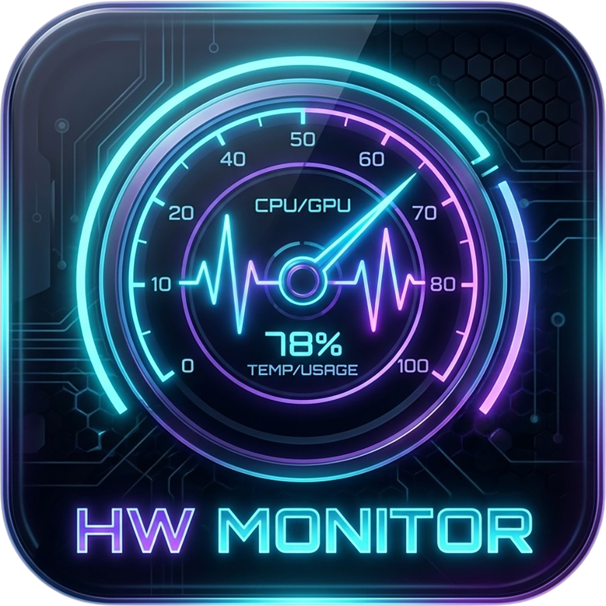

# Hardware Monitor PRO

Una estación de monitoreo térmico y de rendimiento de nivel profesional con estética **Cyberpunk**. Diseñada para ofrecer una visualización profunda y en tiempo real de CPU, GPU, RAM y múltiples unidades de almacenamiento con un impacto visual mínimo en el sistema.


---

## 🎨 Icono del Proyecto

<p align="center">
    
</p>

---

## ✨ Características Principales

*   **⚡ Vista en Vivo (Ultra-Responsive)**: Datos actualizados cada segundo con barras de progreso dinámicas que cambian de color según la carga.
*   **📊 Analítica Avanzada**: Gráficos interactivos con escalado inteligente (+/- 10 unidades) para detectar fluctuaciones térmicas mínimas.
*   **💾 Persistencia de Usuario**: El sistema utiliza `localStorage` para recordar tu configuración, intervalo de tiempo (1m a 1h) y preferencias de visualización.
*   **📂 Telemetría Inteligente**: Detección automática y ordenado alfabético de todas las unidades de almacenamiento (NVMe, SSD, HDD).
*   **⚙️ Umbrales Personalizables**: Ajusta los niveles de alerta (Medio, Alto, Crítico) directamente desde la interfaz web.
*   **💎 Diseño Premium**: Interfaz moderna con efectos de *glassmorphism*, tipografía **Inter** y **JetBrains Mono** para máxima legibilidad.

---

## 🛠️ Requisitos Técnicos

| Requisito | Detalle |
| :--- | :--- |
| **Sistema Operativo** | Windows 10 / 11 (64-bit) |
| **Python** | Versión 3.10 o superior (Agregado al PATH) |
| **HWiNFO64** | v7.0 o superior (Motor de sensores) |
| **Permisos** | Ejecución de PowerShell habilitada |

---

## ⚙️ Configuración Crítica de HWiNFO64

Para que el Dashboard funcione correctamente, HWiNFO64 **debe** estar configurado siguiendo estos pasos exactos:

1.  **Inicio**: Ejecuta HWiNFO64. En la ventana inicial, marca **únicamente** la casilla **"Sensors-only"**.
2.  **Memoria Compartida**:
    *   Ve a `Settings` -> `General`.
    *   Activa la casilla **"Shared Memory Support"**.
    *   > [!NOTE]
    *   > En la versión gratuita de HWiNFO, esta opción se desactiva tras 12 horas. Solo debes cerrar y volver a abrir la aplicación para reactivarla.
3.  **Optimización**: Se recomienda marcar **"Minimize Main Window on Startup"** y **"Minimize Sensors on Startup"** para que el sistema corra silenciosamente en segundo plano.

---

## 🚀 Guía de Instalación Paso a Paso

### 1. Preparación del Entorno
Asegúrate de tener Python instalado y HWiNFO64 abierto con la configuración mencionada arriba. Puedes usar el instalador `hwi64_846.exe` incluido en la carpeta si no lo tienes.

### 2. Ejecución del Orquestador
Haz clic derecho sobre el archivo `start_monitor.bat` y selecciona **"Ejecutar como administrador"**.
> [!IMPORTANT]
> Los permisos de administrador son esenciales la primera vez para permitir que PowerShell acceda a los contadores de rendimiento de bajo nivel.

### 3. Acceso al Dashboard
El script abrirá automáticamente tu navegador predeterminado. Si no ocurre, navega manualmente a:
👉 `http://localhost:8000/monitor.html`

---

## 📂 Estructura del Proyecto

```text
.
├── data/               # Archivos JSON de telemetría en tiempo real
├── hwi64_846.exe       # Instalador de HWiNFO64 (v8.46)
├── monitor.html        # Interfaz visual del Dashboard
├── server.py           # Servidor web local ligero (Python)
├── hwmonitor.ps1       # Motor de extracción de datos (PowerShell)
├── start_monitor.bat   # Script de arranque automático
├── icon.png            # Icono oficial del proyecto
└── icon.ico            # Icono para ejecutables de Windows
```

---

## ⚠️ Solución de Problemas Comunes

**❌ El estado se queda en "SINCRONIZANDO"**
- Verifica que HWiNFO64 esté abierto y con el **"Shared Memory Support"** activado.
- Asegúrate de que el script de PowerShell (`hwmonitor.ps1`) no esté siendo bloqueado por tu antivirus.

**❌ No se puede abrir la página web**
- Comprueba que el puerto 8000 no esté siendo usado por otra aplicación.
- Ejecuta `python --version` en una terminal para confirmar que Python está bien instalado.

**❌ Faltan sensores o unidades**
- Ejecuta el script como Administrador para garantizar el acceso total al hardware.

---

## 📝 Información Adicional

- **Tecnologías**: Python, PowerShell API, HTML5/CSS3 (Vanilla JS), Chart.js.
- **Versión**: 2.6 (Actualización de Estabilidad)

---
*Desarrollado por **gwalls86***

